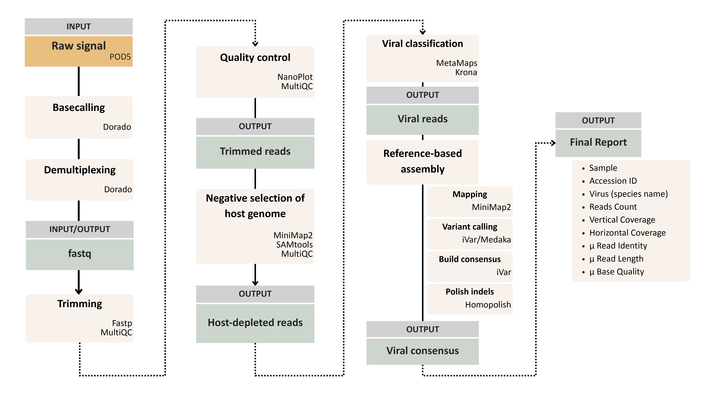

[](https://www.nextflow.io/)
[](https://www.docker.com/)
[](https://sylabs.io/docs/)
[](https://docs.conda.io/en/latest/)
[](https://nfcore.slack.com/channels/metatropics)
[](https://tower.nf/launch?pipeline=https://github.com/nf-core/metatropics)

# Metatropics
The metatropics pipeline is a [Nextflow](https://www.nextflow.io/)-driven workflow designed for viral identification and the creation of consensus genomes from nanopore (metagenomic) sequencing data. It leverages container systems like [Docker](https://www.docker.com) and [Singularity](https://sylabs.io/docs/), utilizing one container per process to avoid software dependency conflicts and simplifies maintainenance. This container-based approach ensures that installation is straightforward and results are highly reproducible. 

### Pipeline summary



For a more detailed description see [Metatropics description](https://github.com/Clinical-Virology-Unit/Metatropics)

### 1. Download metatropics pipeline on Linux
```
sudo apt update
sudo apt install git
git config --global http.postBuffer 524288000
git clone https://github.com/Clinical-Virology-Unit/Metatropics.git
```

### 2. Install Java and Nextflow
Install [`Nextflow`](https://www.nextflow.io/docs/latest/getstarted.html#installation) (`>=22.10.1`)
```
sudo apt-get install curl
curl -s https://get.sdkman.io | bash

Open a new terminal

sdk install java 17.0.10-tem
java -version
curl -s https://get.nextflow.io | bash
chmod +x nextflow
sudo mv nextflow /usr/local/bin 
nextflow info
```

### 3. Install container system
Install any of the following container systems [`Docker`](https://docs.sevenbridges.com/docs/install-docker-on-linux), [`Singularity`](https://www.sylabs.io/guides/3.0/user-guide/), [`Podman`](https://podman.io/), [`Shifter`](https://nersc.gitlab.io/development/shifter/how-to-use/) or [`Charliecloud`](https://hpc.github.io/charliecloud/) for full pipeline reproducibility. If possible, use Docker.

Docker example:  
```
curl -fsSL https://get.docker.com/ | sh
sudo usermod -aG docker <your_username>
sudo chmod 666 /var/run/docker.sock
docker run hello-world
sudo service docker restart
```

### 4. Download Databases 
This includes: i) Viral Refseq, ii) Human genome and iii) Mosquito (host) genomes databases.

**Choice 1: Viral database**
```
cd Metatropics/Databases
wget -c https://zenodo.org/records/13132915/files/combined_databases.tar.gz
tar -xzvf combined_databases.tar.gz
rm combined_databases.tar.gz
```

### 5. Resource Optimization
**Note:** Allocate resources for enhanced computational efficiency. This version is optimized for a 64 GB RAM, 20-core Linux computer. If your computer is similar, use the default settings. If not, or if unsure, optimize accordingly:

**Note:** Determine resources

```
free -h
nproc
```

**Note:** Optimize resources by allocating the required process labels (single, low, medium, high)

```
cd Metatropics/nf-metatropics/conf
nano base.config
```

### 6. Set PATHs

**Note:** Use params.yaml file for processing from raw reads (FASTQ format) and switch to the params2.yml file when dealing with squiggles (POD5 format).

```
cd Metatropics
nano params.yml

input: change to input PATH
outdir: change to output PATH
Human_host_fasta: optional path to the human background genome 
Other_host_fasta: optional path to any additional host genome 
dbmeta: change to ViralRefseq database PATH
quality: 30 # for high-quality genomes
depth 20 # for high-quality genomes
```

### 7. Set Input

**Note:** Ensure that all your input FASTQ reads are consolidated into a single file rather than being spread across multiple files in directories like barcode01/fastq. To facilitate this, a bash script named concatenate_fastq.sh is available in the 'Input' folder. You can use this script to merge all FASTQ files in the barcode01 directory into a single barcode01.fastq file by running the command: bash concatenate_fastq.sh. The format of the `mpox.csv` [Input](https://github.com/Clinical-Virology-Unit/Metatropics/tree/main/Input) file differs based on your starting data:
- For raw reads (FASTQ): (<u>use params.yml</u>)
```
The params.yaml file contains the most important paths
sample,single_end,barcode
sample_name01,True,/home/antonio/metatropics/nf-metatropics/fastq/barcode01.fastq
sample_name02,True,/home/antonio/metatropics/nf-metatropics/fastq/barcode02.fastq
```

- For squiggle data (POD5): (<u>use params2.yml</u>)
```
sample,single_end,barcode
sample_name01,True,barcode01
sample_name02,True,barcode02
```

### 8. Runing pipeline

```
nextflow run nf-metatropics/ -profile docker -params-file params.yaml -resume
```

   ```
   nextflow run nf-metatropics/ --help

   Input/output options
    --input                       [string]  Path to comma-separated file containing information about the samples in the experiment.
    --input_dir                   [string]  Input directory with POD5 [default: None]
    --outdir                      [string]  The output directory where the results will be saved. You have to use absolute paths to storage on Cloud infrastructure.
Reference genome options
    --Human_host_fasta            [string]  Optional FASTA for the human background removal step.
    --Other_host_fasta            [string]  Optional FASTA for an additional host background (e.g. mosquito, primate).
    --dbmeta                      [string]  Path for the MetaMaps database for read classification [default: None]
   Generic options
    --basecall                    [boolean] In case POD5 is the input, that option shoud be true [default: false]
    --model                       [string]  In case POD5 is the input, the dorado model for basecalling should be provided. Choose from: fast, hac, or sup [default: hac]
    --kit_name                    [string]  In case POD5 is the input, the kit name should be provided. Available options include: EXP-NBD103, EXP-NBD104, EXP-NBD114, EXP-NBD114-24, EXP-NBD196, EXP-PBC001, EXP-PBC096, SQK-16S024, SQK-16S114-24, SQK-LWB001, SQK-MLK111-96-XL, SQK-MLK114-96-XL, SQK-NBD111-24, SQK-NBD111-96, SQK-NBD114-24, SQK-NBD114-96, SQK-PBK004, SQK-PCB109, SQK-PCB110, SQK-PCB111-24, SQK-PCB114-24, SQK-RAB201, SQK-RAB204, SQK-RBK001, SQK-RBK004, SQK-RBK110-96, SQK-RBK111-24, SQK-RBK111-96, SQK-RBK114-24, SQK-RBK114-96, SQK-RLB001, SQK-RPB004, SQK-RPB114-24, TWIST-16-UDI, TWIST-96A-UDI, VSK-PTC001, VSK-VMK001, VSK-VMK004, VSK-VPS001 [default: TWIST-96A-UDI]
    --minLength                   [integer] Minimum length for a read to be analyzed. [default: 200]
    --minVirus                    [number]  Minimum virus data frequency in the raw data to be part of the output. [default: 0.01]
    --usegpu                      [boolean] In case POD5 is the input, the use of GPU Nvidia should be true.
    --pair                        [boolean] If barcodes were added at both sides of a read (true) or only at one side (false).
    --quality                     [integer] Minimum quality for a base to build the consensus [default: 7]
    --agreement                   [number]  Minimum base frequency to be called without ambiguit to build the consensus [default: 0.7]
    --depth                       [integer] Minimum depth of a position to build the consensus [default: 5]
    --front                       [integer] Number of bases to delete at 5 prime of the read [default: 0]
    --tail                        [integer] Number of bases to delete at 3 prime of the read [default: 0]
    --rcoverage                   [string]  Coverage figures [default: false]
    --horizontal_coverage         [integer] Minimum horizontal coverage threshold [default: 1]
   Rarefaction options
    --perform_rarefaction         [boolean] Option to perform rarefaction to a specified number of bases [default: false]
    --target_bases                [number]  Number of bases to which you want to rarefy each sample [default: 1 billion bases, equivalent to 500,000 reads of 2kb each]
   Docker cleanup 
    --enable_docker_cleanup       [boolean] Removes all downloaded Docker images to free up root space [default: false]
   ```
**Note:** If internet access is unavailable, disable the docker cleanup option to retain images after the initial download, allowing the pipeline to run without internet access.

### 9. Output
Below one can see the output directories and their description. `basecalling` and `demultiplexing` will exist only in case the user has used POD5 files as input.

1. [`basecalling`] - fastq files after the basecalling without being demultiplexed
2. [`demultiplexing`] - directories and fastq files produced after demultiplexing
3. [`fix`] - gziped fastq files for each sample of the run
4. [`rarefaction`] - gziped fastq files for each rarefied sample
5. [`fastp`] - results after trimming analysis performed by FASTP
6. [`nanoplot`] - quality results for the sequencing data just after demultiplexing
7. [`minimap2`] - BAM files about mapping against host genome
8. [`nohuman`] - gziped fastq files without reads mapping to human genome
9. [`nohost`] - gziped fastq files without reads mapping to host genome (-optional)
10. [`metamaps`] - results from both steps of Metamaps execution for read classification (mapDirectly and Classify)
11. [`r`] - intermediate table report and graphical PDF report for each sample
12. [`ref`] - header of the reads and fasta reference genomes for each virus found for each sample
13. [`krona`] - HTML files for each sample with interactive composition pie chart
14. [`reffix`] - fasta refence genomes with fixed header for each virus found during the run
15. [`seqtk`] - gziped fastq file for each set of read classified to a virus for each sample
16. [`medaka`] - BAM file for each virus with mapping results from the virus genome reference for each sample
17. [`samtools`] - mapping statistics calculated to BAM files present in the `medaka` directory
18. [`ivar`] - consensus sequences produced for each virus found in each sample
19. [`bam`] - detailed statistics for the BAM files from `medaka` directory for each position of virus refence genome
20. [`homopolish`] - consensus sequence for each virus in each sample polished for the indel variations
21. [`addingDepth`] - table report for each virus in each sample
22. [`final`] - final table report for all the run
23. [`pipeline_info`] - reports on the execution of the pipeline produced by NextFlow
24. [`rcoverage`] - PDF files including coverage figures of identified viruses
25. [`read_count`] - PDF and CSV files representing read distribution. These figures visualize the distribution of all reads, including trimmed, human, viral, and other reads.

**Note:** For the INRB mpox analysis, the most important files are the polished consensus sequences (20), the final report (22), the coverage (24) and read distribution figures (25). 

Tip 1: If you have limited space, you can delete the 'work' directory and, after selecting the necessary output files, also remove the 'output' directory.

Tip 2: When you encounter errors, make sure to double-check the memory allocated to your processes. This is often the cause, or alternatively, consider including rarefaction.
