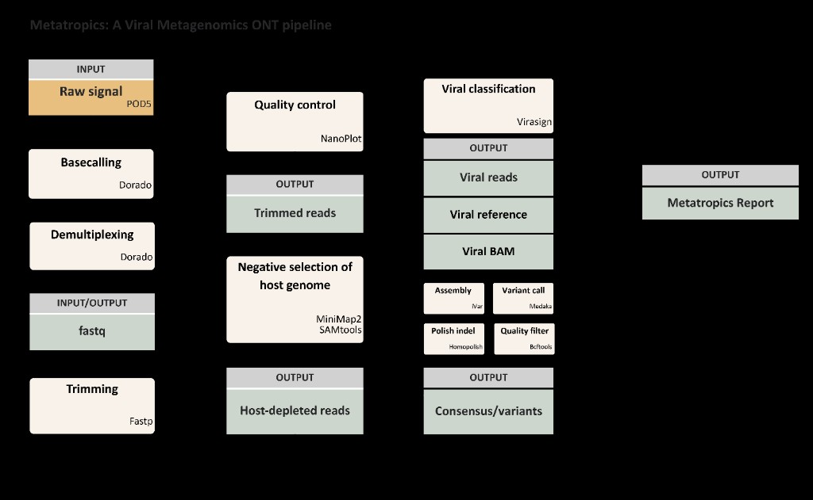

[](https://www.nextflow.io/)
[](https://www.docker.com/)
[](https://sylabs.io/docs/)
[](https://nfcore.slack.com/channels/metatropics)
[](LICENSE)

# Metatropics: A Viral Metagenomics ONT Pipeline

**Metatropics** is a Nextflow-driven bioinformatics pipeline for metagenomic Oxford Nanopore sequencing data. It is built to detect viral pathogens in complex samples (e.g. blood and swabs from a range of body sites) and, where coverage allows, to generate high-quality viral consensus genomes and to perform variant analysis.

**Metatropics** is an abbreviation of **Metagenomics for Tropical Fevers**, and reflects how the project began, with an emphasis on finding human viral pathogens in patients presenting with tropical fevers. The same pipeline has since been validated and applied outside that first setting, including for other febrile syndromes, for genomic surveillance, and for research and diagnostic questions around viral pathogens relevant to human health.

---

## Pipeline summary



---

## 1. Clone the repository
```bash
git clone https://github.com/DaanJansen94/Metatropics.git
cd Metatropics
```

---

## 2. Java and Nextflow
You need **Java 17+** and **[Nextflow](https://www.nextflow.io/docs/latest/getstarted.html#installation) ≥ 22.10.1**. On Debian/Ubuntu you can do:
```bash
sudo apt update && sudo apt install -y openjdk-17-jdk curl
curl -sSL https://get.nextflow.io | bash
chmod +x nextflow && sudo mv nextflow /usr/local/bin/
nextflow -version
```

---

## 3. Containers
Use **[Docker](https://docs.docker.com/engine/install/)** on a typical Linux workstation (example below), or **[Singularity](https://sylabs.io/docs/) / [Apptainer](https://apptainer.org/docs/)** on many HPC clusters - then run with the matching Nextflow profile (e.g. `-profile docker`, `-profile singularity`).

**Docker** (example):
```bash
curl -fsSL https://get.docker.com/ | sudo sh
sudo usermod -aG docker "$USER"   # then log out and back in (or `newgrp docker`)
docker run --rm hello-world
```

---

## 4. Configure paths (input, output)

At the repository root, choose the params file to match how you start and edit it using absolute paths.

### FASTQ start (basecalled reads)

Use **[`params_fastq.yaml`](params_fastq.yaml)**.

| Setting | Purpose |
|-----|-------------------|
| `input` | Copy **[`fastq.csv`](nf-metatropics/assets/submission/fastq.csv)** from [`nf-metatropics/assets/submission/`](nf-metatropics/assets/submission/), edit it, then set `input` to that file’s absolute path. |
| `outdir` | Where results are written. |
| `Host` | Optional: host depletion (e.g., `human,pan`). |
| `virasign_ultrasensitive` | Optional: enable ultrasensitive viral identification mode. |

To autogenerate a [`fastq.csv`](nf-metatropics/assets/submission/fastq.csv) from a reads folder, run **`pip install .`** once at the repo root, then **`metatropics-samplesheet -i .`** from your FASTQ directory.

### POD5 start (basecalling inside the pipeline)

Use **[`params_POD5.yaml`](params_POD5.yaml)**.

| Setting | Purpose |
|-----|-------------------|
| `input` | Copy **[`POD5.csv`](nf-metatropics/assets/submission/POD5.csv)** from [`nf-metatropics/assets/submission/`](nf-metatropics/assets/submission/), edit it, then set `input` to that file’s absolute path. |
| `input_dir` | Directory containing POD5 files. |
| `outdir` | Where results are written. |
| `kit_name` | Dorado `--kit-name` (default: `TWIST-96A-UDI`). |
| `Host` | Optional: host depletion (e.g., `human,pan`). |
| `virasign_ultrasensitive` | Optional: enable ultrasensitive viral identification mode. |

Additional options: **[`nf-metatropics/assets/submission/all_options.md`](nf-metatropics/assets/submission/all_options.md)**.

---

## 5. Running Metatropics

With your `params_fastq.yaml` or `params_POD5.yaml` in place, run from the repository root (swap `-profile docker` for e.g. `-profile singularity`, if needed):

```
nextflow run nf-metatropics/ -profile docker -params-file params_fastq.yaml -resume
```

---

## 6. Output

Results are written under your chosen `--outdir` and summarized below:

| Group | Role |
|--------|------|
| **`Basecalling/`** | Dorado basecalling and demultiplexing (optional). |
| **`Reads/`** | Read QC, trimming, human / optional host depletion. |
| **`Classification/`** | Virasign viral classification outputs and reports. |
| **`Variant_calling/`** | Medaka alignments and variant calls (VCFs). |
| **`Consensus/`** | iVar draft and Homopolish polished genomes. |
| **`Summary/`** | Final Metatropics report (`Summary/metatropics/Metatropics_Summary_RVDB.html`) listing all identified viruses, plus read-count summaries and pipeline provenance. |

For a detailed description of each output subfolder, see [`nf-metatropics/assets/output/README.md`](nf-metatropics/assets/output/README.md).

---

## 7. High performance computing

You can run Metatropics on a high-performance cluster instead of a local workstation. For the Flemish Tier‑1 system CalcUA (VSC Antwerp), ready-made Slurm submission scripts and Nextflow profiles live under [`nf-metatropics/assets/calcua/`](nf-metatropics/assets/calcua/). Setup, editing the batch scripts, and `sbatch` commands are documented in the [CalcUA README](nf-metatropics/assets/calcua/README.md).

---

## 8. Citation

If you use Metatropics in your research, please cite:

```
De Souza Novaes, A., Jansen, D., de Block, T., Vercauteren, K., & Rezende, A. M. (2026). Metatropics: Human viral pathogen identification and consensus genome calling from nanopore metagenomic sequencing data (Version 0.0.7). GitHub. https://github.com/DaanJansen94/Metatropics
```

Also cite the nf-core framework, and other tools you rely on; see [`nf-metatropics/assets/citing/CITATIONS.md`](nf-metatropics/assets/citing/CITATIONS.md).