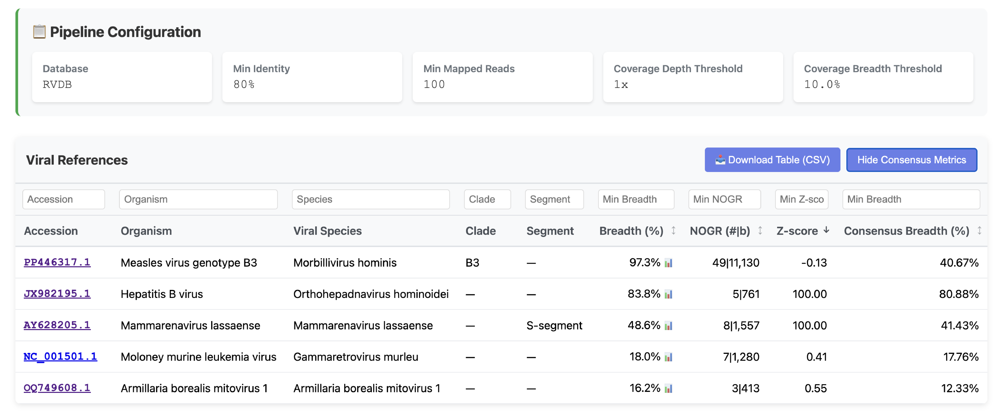

# Metatropics result folders (detailed)

Paths below are relative to your pipeline **`--outdir`**. The pipeline also creates a Nextflow **`work/`** directory; what follows is only what is published into `outdir`.

---

## Overview

| Group | Role |
|--------|------|
| **`Basecalling/`** | Dorado basecalling and demultiplexing (optional). |
| **`Reads/`** | Read QC, trimming, human / optional host depletion. |
| **`Classification/`** | Virasign viral classification outputs and reports |
| **`Variant_calling/`** | Clair3 variant calls (VCFs) and reports. |
| **`Consensus/`** | Final consensus genomes produced by `bcftools consensus`. |
| **`Summary/`** | Final Metatropics report (`Summary/metatropics/Metatropics_Summary_RVDB.html`) listing all identified viruses, plus read-count summaries and pipeline provenance. |

---

## `Basecalling/` (optional)

| Path | Contents |
|------|----------|
| `Basecalling/basecalling` | Intermediate FASTQ from Dorado before demultiplexing. |
| `Basecalling/demultiplexing` | Per-barcode FASTQ after demultiplexing (trims barcodes and adapters). |

---

## `Reads/`

This stage optionally performs rarefaction, then removes low-quality reads, short reads, and reads that match host background (e.g. human, pan). The host-depleted read set is fed to the rest of the pipeline.

| Path | Contents |
|------|----------|
| `Reads/raw` | Per-sample raw reads after naming / format fixes (`*_fixed.fastq.gz`). |
| `Reads/rarefaction` | Optional: Per-sample FASTQ after optional rarefaction subsampling. |
| `Reads/nanoplot` | Read-length and quality summaries (NanoPlot) on the raw reads. |
| `Reads/fastplong` | Trimmed, length-filtered reads (`*.fastp.fastq.gz`). |
| `Reads/nohuman` | Human-depleted reads (`*_human_depleted.fastq.gz`); mapped reads (`*_human.fastq.gz`). |
| `Reads/nohost` | Host-depleted reads (`*_host_depleted.fastq.gz`); mapped reads (`*_host.fastq.gz`). |

---

## `Classification/`

Host-depleted reads are mapped to the metagenomic database (e.g., Refseq, RVDB) and summarized so you can see which organisms (taxa) are present in each sample.

| Path   | Contents |
|--------|----------|
| `Classification/virasign/` | Virasign per-sample viral classification results. |

| Output | Meaning  |
|--------|----------|
| `*_unfiltered_all_references.json` | All candidate viral hits. |
| `*_final_selected_references.json` | Final confident viral hits. |
| `*.fasta` | Best reference sequence(s) selected by Virasign. |
| `mreads.fastq.gz` | Reads mapped to the reference(s) for each virus. |
| `*.bam` | Read alignments against the best reference(s). |
| `*.bai` | BAM index for the alignments. |
| `*coverage*.pdf` | Coverage plots per virus/reference. |

For more Virasign details, see [`DaanJansen94/virasign`](https://github.com/DaanJansen94/virasign).

---

## `Variant_calling/`

For each candidate virus, **[Clair3](https://github.com/HKU-BAL/Clair3)** performs haploid variant calling on the Virasign-produced BAM (reads aligned to the selected viral reference) and emits a VCF describing differences from that reference. Metatropics then applies a uniform post-processing step that re-counts allele support from the BAM (with mapping/base-quality filters), labels variants as major/minor, and produces a VCF + HTML report.

| Path | Contents |
|------|----------|
| `Variant_calling/clair3` | Variant calls and report (`*.variants.filtered.vcf`, `*.variants.unfiltered.vcf`, `*.variants.html`). |

---

## `Consensus/`

Consensus building starts from the Virasign-selected reference FASTA and then applies only the variants called by Clair3 to produce the final consensus with `bcftools consensus`. By default, only variants labelled major and with VAF ≥ `--agreement` are applied; everything else remains as the reference base.

| Path | Contents |
|------|----------|
| `Consensus/bcftools` | Final consensus FASTA produced by `bcftools consensus`. |

---

## `Summary/`

Metatropics reports, run-wide summaries, and provenance.

| Path | Contents |
|------|----------|
| `Summary/readcount` | Read distribution (`read_distribution.html`). |
| `Summary/metatropics` | Final Metatropics HTML report (`Metatropics_Summary_*.html`). |
| `Summary/pipeline_info` | Nextflow trace/reports and software versions (`software_versions.yml`). |

Open the final HTML report at **`Summary/metatropics/Metatropics_Summary_RVDB.html`** for fast interpretation of whether a virus is likely truly present: scan the table for the strongest signals, then click through to coverage/classification outputs for any hit you want to confirm.

<small>

**How to interpret the summary table** (vary by virus, genome, protocol)

Start by combining mapped reads, coverage depth, and consensus breadth: when all three are high, the hit is usually strong. When consensus breadth is low, NOGR helps judge whether evidence is spread across the genome or concentrated in a short pile-up, but you should also inspect the coverage plot (example below) to catch patterns like amplicon contamination. Z-score (when present) helps flag hits consistent with negative-control background / carryover. For more detail, see [`NOGR.md`](./NOGR.md) and [`Z_SCORE.md`](./Z_SCORE.md).

| Indicator | Typical / rule of thumb | Notes |
|---|---|---|
| Mapped reads | ≥100–1000+ | More reads → stronger support. |
| Coverage depth | ~1–10× common | Higher better; very low → rely more on consensus breadth + NOGR. |
| Consensus breadth | e.g. ≥80–90% | Near-complete → usually strong on its own. |
| NOGR (#/bases) | ≥3 regions if consensus breadth low | More regions → spread-out; 1–2 → pile-up risk. |
| Z-score | ≥~3 vs controls | Use to spot negative-control-like background / carryover; best for low reads / low breadth. |

</small>

**Example**

